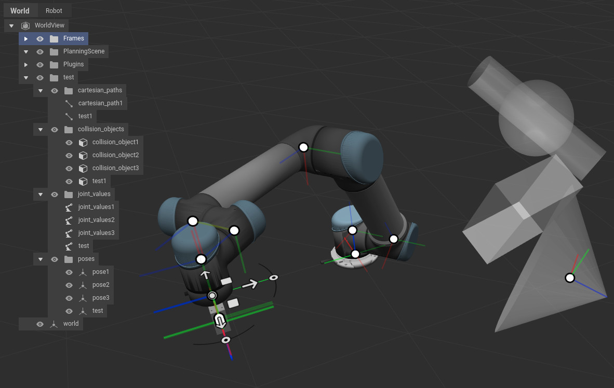

.. role:: hidden
    :class: hidden-section

WorldView client
=========================

.. automodule:: xamla_motion
.. currentmodule:: xamla_motion

Overview
------------------------------------------
One of the main features of ROSVITA is the WorldView.
The WorldView is the place in which the current configration
is visualized. But it not only visualize the current state of
the work cell it is also the place where we can move the robot,
save specific poses or robot joint configurations and add collision objects
which should be considered when new trajectories are planned.  

   ROSVITA WorldView example

To get access to the stored entities in WorldView or to add new or manipulate
existing onces the :class:`xamla_motion.WorldViewClient` class can be used.
At the moment following functionalities are provided: 

- Add and remove folders from WorldView 
- Add, get, update, query and remove poses, joint values/configurations, cartesian paths and collision objects. 

Example:

.. literalinclude:: ../../examples/example_world_view_client.py
    :lines: 21-

WorldViewClient
------------------------------------------
.. autoclass:: WorldViewClient
    :members: